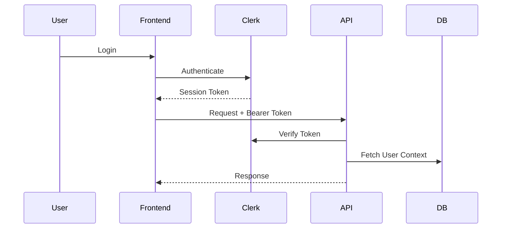

# GigLens - Design Document

## 1. Architecture Overview

GigLens uses a modern, hybrid architecture combining a robust Next.js frontend with specialized services for ML and Voice processing.

```mermaid
graph TD
    Client[Client (Next.js PWA)] -->|HTTP/JSON| API[Next.js API Routes]
    Client -->|Auth| Clerk[Clerk Auth]
    API -->|ORM| DB[(PostgreSQL + Prisma)]
    API -->|Voice| Groq[Groq LLaMA 3.3]
    API -->|Telephony| Twilio[Twilio Voice]
    API -->|Predictions| ML[Python FastAPI Service]
    ML -->|Inference| Models[Scikit-Learn Models]
```

## 2. System Architecture

### 2.1 Frontend Architecture
- **Framework**: Next.js 16 (App Router)
- **Styling**: Tailwind CSS v4
- **State**: Zustand (Global Store), React Context (Theme/Auth)
- **Key Modules**:
  - `(dashboard)`: Protected routes for authenticated users.
  - `api/voice-agent`: Handles voice interactions via Groq.
  - `components/ui`: Reusable primitives (buttons, cards, dialogs).

### 2.2 Backend Integration
The backend is split into two logical layers:
1. **Next.js Serverless API**: Handles business logic, DB interactions, and external API calls (Groq, Twilio).
2. **Python ML Service**: Dedicated FastAPI service for compute-intensive financial modeling and credit scoring.

### 2.3 Authentication Flow (Clerk)
User authentication is fully managed by Clerk, ensuring secure session handling.



## 3. Database Design (Prisma Schema)
The core data models revolve around user profiles and financial snapshots.

### Core Models
- **User**: Linked to Clerk ID, stores basic profile info.
- **FinancialSnapshot**: Monthly/Weekly financial records (Revenue, Expenses, EBITDA).
- **Forecast**: Future cash flow predictions generated by the ML engine.
- **Recommendations**: Personalized financial advice based on health and karma scores.

## 4. AI & Voice Design
- **Web Voice Assistant**:
  - **Input**: Web Speech API captures user audio.
  - **Processing**: Transcript sent to `/api/voice-agent`.
  - **Intelligence**: Groq LLaMA 3.3 processes query with "Grounding Data" (Balance, Score, etc.).
  - **Output**: Text response + Speech Synthesis.

- **Telephony Assistant**:
  - **Input**: Twilio Programmable Voice call.
  - **Processing**: `/api/voice` endpoint generates TwiML.
  - **Output**: Voice response over phone.

## 5. Technology Stack Summary

### Frontend
- **Core**: Next.js 16, React 19, TypeScript
- **Style**: Tailwind CSS, Radix UI, Lucide React
- **Data Vis**: Recharts, Chart.js

### Backend & Data
- **API Runtime**: Node.js (Next.js) & Python 3.12 (FastAPI)
- **Database**: PostgreSQL
- **ORM**: Prisma
- **Auth**: Clerk

### AI Services
- **LLM**: Groq (LLaMA 3.3 70B)
- **Voice**: Twilio, Web Speech API
- **ML Libs**: Scikit-learn, Pandas, NumPy