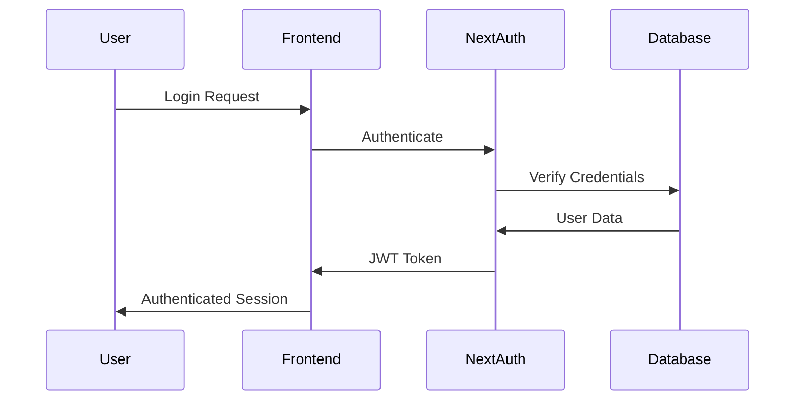

# GigLens - Design Document

## Architecture Overview

GigLens follows a modern, scalable architecture pattern using Next.js as a full-stack framework with PWA capabilities. The application is designed as a client-side heavy application with API integration capabilities and offline-first functionality.

```
┌─────────────────────────────────────────────────────────────┐
│                    Client Layer (PWA)                       │
├─────────────────────────────────────────────────────────────┤
│  Next.js App Router │ React Components │ Service Worker     │
│  TypeScript         │ Tailwind CSS     │ Offline Cache      │
└─────────────────────────────────────────────────────────────┘
                              │
                              ▼
┌─────────────────────────────────────────────────────────────┐
│                    API Layer                                │
├─────────────────────────────────────────────────────────────┤
│  Next.js API Routes │ External ML API  │ Authentication     │
│  Axios HTTP Client  │ Python Backend   │ NextAuth           │
└─────────────────────────────────────────────────────────────┘
                              │
                              ▼
┌─────────────────────────────────────────────────────────────┐
│                    Data Layer                               │
├─────────────────────────────────────────────────────────────┤
│  Prisma ORM        │ Database         │ Local Storage      │
│  Zustand State     │ File System      │ IndexedDB          │
└─────────────────────────────────────────────────────────────┘
```

## System Architecture

### Frontend Architecture

#### Component Structure
```
src/
├── app/                    # Next.js App Router
│   ├── (dashboard)/       # Dashboard route group
│   ├── api/               # API routes
│   ├── globals.css        # Global styles
│   ├── layout.tsx         # Root layout
│   ├── manifest.ts        # PWA manifest
│   └── page.tsx           # Home page
├── components/            # Reusable components
│   ├── ui/               # Base UI components
│   ├── dashboard/        # Dashboard-specific components
│   ├── goals/            # Goal management components
│   ├── jobs/             # Job-related components
│   └── layout/           # Layout components
├── context/              # React Context providers
├── hooks/                # Custom React hooks
├── lib/                  # Utility libraries
└── services/             # API service layers
```

#### State Management
- **Global State**: Zustand for application-wide state
- **Server State**: React Query patterns for API data
- **Local State**: React useState for component-specific state
- **Context**: React Context for theme, auth, and language

#### Routing Strategy
- **App Router**: Next.js 13+ App Router for file-based routing
- **Route Groups**: Organized by feature areas (dashboard, auth, etc.)
- **Dynamic Routes**: For user-specific and parameterized pages
- **Middleware**: Authentication and route protection

### Backend Integration

#### API Architecture
```typescript
// API Client Structure
interface APIClient {
  auth: AuthService;
  predictions: MLService;
  transactions: TransactionService;
  goals: GoalService;
  users: UserService;
}

// Service Layer Pattern
class MLService {
  async getPrediction(data: PredictionData): Promise<PredictionResponse>
  async getScoreHistory(userId: string): Promise<ScoreHistory[]>
  async updateUserMetrics(userId: string, metrics: UserMetrics): Promise<void>
}
```

#### Data Flow
1. **User Input** → Component State
2. **State Change** → API Service Call
3. **API Response** → Global State Update
4. **State Update** → Component Re-render
5. **Offline Fallback** → Local Calculation

### PWA Architecture

#### Service Worker Strategy
```javascript
// Cache Strategy
const CACHE_STRATEGY = {
  pages: 'NetworkFirst',      // Dynamic content
  assets: 'CacheFirst',       // Static assets
  api: 'NetworkFirst',        // API calls with fallback
  offline: 'CacheOnly'        // Offline pages
};
```

#### Offline Capabilities
- **Core Pages**: Dashboard, goals, settings cached
- **Data Persistence**: IndexedDB for offline data
- **Sync Strategy**: Background sync when online
- **Fallback Logic**: Local calculations when API unavailable

## Database Design

### Data Models

#### User Model
```typescript
interface User {
  id: string;
  email: string;
  name: string;
  phone?: string;
  createdAt: Date;
  updatedAt: Date;
  
  // Relations
  profile: UserProfile;
  transactions: Transaction[];
  goals: Goal[];
  scores: CreditScore[];
}
```

#### Financial Data Models
```typescript
interface Transaction {
  id: string;
  userId: string;
  amount: number;
  type: 'income' | 'expense';
  category: string;
  description: string;
  date: Date;
  platform?: string;
}

interface CreditScore {
  id: string;
  userId: string;
  score: number;
  approvalProbability: number;
  maxLoanAmount: number;
  calculatedAt: Date;
  factors: ScoreFactor[];
}
```

### Database Schema
```sql
-- Core Tables
Users (id, email, name, phone, created_at, updated_at)
UserProfiles (user_id, annual_income, debt_amount, savings_rate, ...)
Transactions (id, user_id, amount, type, category, date, ...)
Goals (id, user_id, title, target_amount, current_amount, ...)
CreditScores (id, user_id, score, approval_probability, ...)

-- Indexes
CREATE INDEX idx_transactions_user_date ON Transactions(user_id, date);
CREATE INDEX idx_scores_user_date ON CreditScores(user_id, calculated_at);
```

## UI/UX Design

### Design System

#### Color Palette
```css
:root {
  /* Primary Colors */
  --primary: #F97316;        /* Orange */
  --primary-foreground: #FFFFFF;
  
  /* Background Colors */
  --background: #FFF7ED;     /* Warm white */
  --card: #FFFFFF;
  --border: #E5E7EB;
  
  /* Text Colors */
  --foreground: #111827;
  --muted-foreground: #6B7280;
  
  /* Status Colors */
  --success: #10B981;
  --warning: #F59E0B;
  --error: #EF4444;
}
```

#### Typography Scale
```css
/* Font Sizes */
.text-xs    { font-size: 0.75rem; }   /* 12px */
.text-sm    { font-size: 0.875rem; }  /* 14px */
.text-base  { font-size: 1rem; }      /* 16px */
.text-lg    { font-size: 1.125rem; }  /* 18px */
.text-xl    { font-size: 1.25rem; }   /* 20px */
.text-2xl   { font-size: 1.5rem; }    /* 24px */
.text-3xl   { font-size: 1.875rem; }  /* 30px */
```

#### Component Library
- **Base Components**: Button, Input, Card, Badge, Progress
- **Composite Components**: DataTable, Chart, Modal, Sidebar
- **Layout Components**: Container, Grid, Stack, Spacer
- **Form Components**: FormField, Select, Checkbox, Switch

### Responsive Design

#### Breakpoint Strategy
```css
/* Mobile First Approach */
.container {
  width: 100%;
  padding: 1rem;
}

@media (min-width: 640px) {  /* sm */
  .container { max-width: 640px; }
}

@media (min-width: 768px) {  /* md */
  .container { max-width: 768px; }
}

@media (min-width: 1024px) { /* lg */
  .container { max-width: 1024px; }
}
```

#### Layout Patterns
- **Mobile**: Single column, bottom navigation
- **Tablet**: Two column, side navigation
- **Desktop**: Multi-column, persistent sidebar

## Security Design

### Authentication Flow


### Data Protection
- **Encryption**: All sensitive data encrypted at rest and in transit
- **Validation**: Input validation on both client and server
- **Sanitization**: XSS protection through proper escaping
- **CSRF Protection**: Built-in Next.js CSRF protection
- **Rate Limiting**: API rate limiting to prevent abuse

### Security Headers
```javascript
// next.config.mjs
const securityHeaders = [
  {
    key: 'X-Content-Type-Options',
    value: 'nosniff'
  },
  {
    key: 'X-Frame-Options',
    value: 'DENY'
  },
  {
    key: 'Referrer-Policy',
    value: 'strict-origin-when-cross-origin'
  }
];
```

## Performance Design

### Optimization Strategies

#### Code Splitting
```typescript
// Route-based splitting
const Dashboard = lazy(() => import('./Dashboard'));
const Goals = lazy(() => import('./Goals'));

// Component-based splitting
const HeavyChart = lazy(() => import('./HeavyChart'));
```

#### Caching Strategy
- **Static Assets**: Long-term caching with versioning
- **API Responses**: Short-term caching with revalidation
- **Database Queries**: Query result caching
- **Service Worker**: Offline caching for core resources

#### Bundle Optimization
- **Tree Shaking**: Remove unused code
- **Code Splitting**: Load code on demand
- **Image Optimization**: Next.js automatic image optimization
- **Font Optimization**: Preload critical fonts

### Performance Metrics
```typescript
// Core Web Vitals Targets
const PERFORMANCE_TARGETS = {
  LCP: 2.5,    // Largest Contentful Paint
  FID: 100,    // First Input Delay
  CLS: 0.1,    // Cumulative Layout Shift
  FCP: 1.8,    // First Contentful Paint
  TTI: 3.8     // Time to Interactive
};
```

## Deployment Architecture

### Build Process
```yaml
# Build Pipeline
stages:
  - install:     npm ci
  - lint:        npm run lint
  - type-check:  npm run type-check
  - test:        npm run test
  - build:       npm run build
  - deploy:      Deploy to hosting platform
```

### Environment Configuration
```typescript
// Environment Variables
interface EnvironmentConfig {
  NODE_ENV: 'development' | 'staging' | 'production';
  NEXT_PUBLIC_API_URL: string;
  DATABASE_URL: string;
  NEXTAUTH_SECRET: string;
  NEXTAUTH_URL: string;
}
```

### Hosting Strategy
- **Static Hosting**: Vercel, Netlify, or similar
- **Serverless Functions**: API routes as serverless functions
- **CDN**: Global content delivery network
- **Database**: Managed database service (PostgreSQL)

## Monitoring & Analytics

### Error Tracking
```typescript
// Error Boundary Implementation
class ErrorBoundary extends Component {
  componentDidCatch(error: Error, errorInfo: ErrorInfo) {
    // Log to monitoring service
    logger.error('Component Error', { error, errorInfo });
  }
}
```

### Performance Monitoring
- **Real User Monitoring**: Core Web Vitals tracking
- **Synthetic Monitoring**: Automated performance tests
- **Error Tracking**: Runtime error monitoring
- **Usage Analytics**: Feature usage and user behavior

### Logging Strategy
```typescript
// Structured Logging
interface LogEntry {
  level: 'info' | 'warn' | 'error';
  message: string;
  timestamp: Date;
  userId?: string;
  context?: Record<string, any>;
}
```

## Scalability Considerations

### Horizontal Scaling
- **Stateless Design**: No server-side session storage
- **API Scaling**: Serverless functions auto-scale
- **Database Scaling**: Read replicas and connection pooling
- **CDN Scaling**: Global edge caching

### Performance Scaling
- **Lazy Loading**: Load components and routes on demand
- **Virtual Scrolling**: Handle large data sets efficiently
- **Memoization**: Cache expensive calculations
- **Debouncing**: Reduce API call frequency

### Data Scaling
- **Pagination**: Limit data transfer per request
- **Indexing**: Optimize database queries
- **Caching**: Multi-layer caching strategy
- **Archiving**: Move old data to cold storage

## Technology Stack Summary

### Frontend Technologies
- **Framework**: Next.js 16+ with App Router
- **Language**: TypeScript 5+
- **Styling**: Tailwind CSS 4+
- **Components**: Radix UI primitives
- **Charts**: Chart.js, Recharts
- **State**: Zustand, React Context
- **Forms**: React Hook Form
- **Dates**: date-fns

### Backend Technologies
- **Runtime**: Node.js (serverless)
- **Database**: Prisma ORM
- **Authentication**: NextAuth.js
- **API Client**: Axios
- **File Processing**: PapaParse
- **Validation**: Zod schemas

### DevOps & Tools
- **Build Tool**: Next.js built-in
- **Linting**: ESLint with Next.js config
- **Type Checking**: TypeScript compiler
- **Testing**: Jest, React Testing Library
- **Version Control**: Git
- **Package Manager**: npm

### Infrastructure
- **Hosting**: Static hosting (Vercel/Netlify)
- **Database**: PostgreSQL/MySQL
- **CDN**: Built-in with hosting platform
- **Monitoring**: Built-in analytics
- **SSL**: Automatic HTTPS